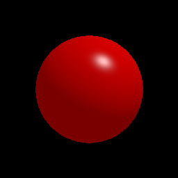
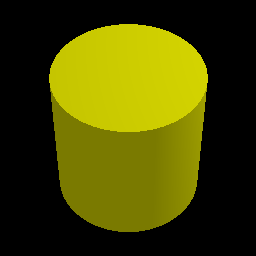
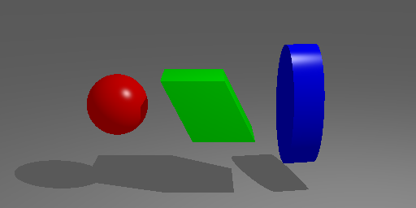

# Ray Tracer

Partial implementation of a ray tracer for my __Introduction to 3D Computer Graphics__ course with multiple different renderings.

#### 3D Shapes  

#### Shadows  

#### Texture/Reflection/Refraction  

